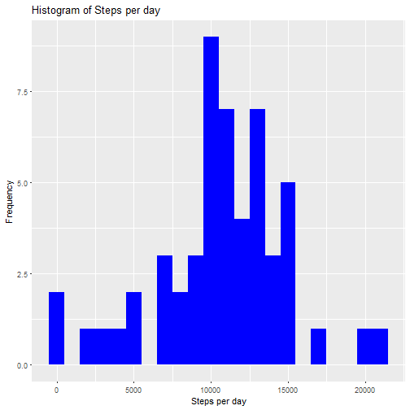
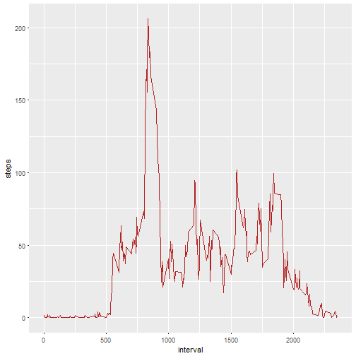
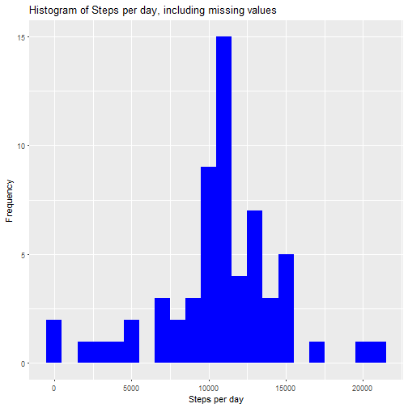
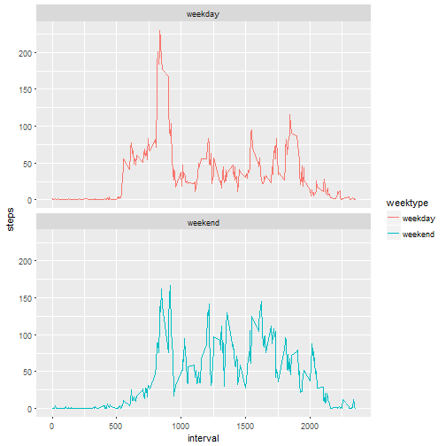

#Prepare R

```r
library(knitr)
opts_chunk$set(echo = TRUE)
require(ggplot2)
require(RColorBrewer)
require(dplyr)
```

#Loading and preprocessing the data

Load the data (i.e. read.csv())

```r
loadData <- function(url="", csvFile="data.csv", zipFile="data.zip") {
  if (!file.exists(csvFile)) {
    if (!file.exists(zipFile)) {
      download.file(url, zipFile)
    }
    unzip(zipFile)
  }
  read.csv(csvFile)
}
```
call the loadData function 

```r
data = loadData("https://d396qusza40orc.cloudfront.net/repdata%2Fdata%2Factivity.zip", "activity.csv", "data.zip")
```

take a look at the data returned

```r
head(data)
```

```
##   steps       date interval
## 1    NA 2012-10-01        0
## 2    NA 2012-10-01        5
## 3    NA 2012-10-01       10
## 4    NA 2012-10-01       15
## 5    NA 2012-10-01       20
## 6    NA 2012-10-01       25
```
Process/transform the data (if necessary) into a format suitable for your analysis

```r
data$weekday <- weekdays(as.Date(data$date))
```

take a look at the change in the dataset

```r
head(data)
```

```
##   steps       date interval weekday
## 1    NA 2012-10-01        0  Monday
## 2    NA 2012-10-01        5  Monday
## 3    NA 2012-10-01       10  Monday
## 4    NA 2012-10-01       15  Monday
## 5    NA 2012-10-01       20  Monday
## 6    NA 2012-10-01       25  Monday
```

#Calculate the total number of steps taken per day, and generate a Histogram
Steps taken each day, with quick view of data

```r
steps <- data %>%
  filter(!is.na(steps)) %>%
  group_by(date) %>%
  summarize(steps = sum(steps)) %>%
  print
```
Histogram representation of steps per day

```r
ggplot(steps, aes(x = steps)) +
  geom_histogram(fill = "blue", binwidth = 1000) +
  labs(title = "Histogram of Steps per day", x = "Steps per day", y = "Frequency")
```



Calculate and report the mean and median of the total number of steps taken per day

```r
mean_steps <- mean(steps$steps, na.rm = TRUE)
median_steps <- median(steps$steps, na.rm = TRUE)
```

```r
mean_steps
```

```
## [1] 10766.19
```

```r
median_steps
```

```
## [1] 10765
```
the mean steps per day is 10766.19, and median steps per day is 10765

#What is the average daily activity pattern?

1. Make a time series plot (i.e. type = "l") of the 5-minute interval (x-axis) and the average number of steps taken, averaged across all days (y-axis)

```r
interval <- data %>%
  filter(!is.na(steps)) %>%
  group_by(interval) %>%
  summarize(steps = mean(steps))
```

```r
ggplot(interval, aes(x=interval, y=steps)) +
  geom_line(color = "firebrick")
```



2. Which 5-minute interval, on average across all the days in the dataset, contains the maximum number of steps? Imputing missing values

```r
interval[which.max(interval$steps),]
```

#Missing Values

Note that there are a number of days/intervals where there are missing values (coded as NA). The presence of missing #days may introduce bias into some calculations or summaries of the data.

1. Calculate and report the total number of missing values in the dataset (i.e. the total number of rows with NAs)

```r
sum(is.na(data$steps))
```

```
## [1] 2304
```

2. Devise a strategy for filling in all of the missing values in the dataset. The strategy does not need to be #sophisticated. For example, you could use the mean/median for that day, or the mean for that 5-minute interval, etc.
3. Create a new dataset that is equal to the original dataset but with the missing data filled in.

```r
nas <- is.na(data$steps)
avg_interval <- tapply(data$steps, data$interval, mean, na.rm=TRUE, simplify=TRUE)
data$steps[nas] <- avg_interval[as.character(data$interval[nas])]
```
check if we have missing values before next step


```r
sum(is.na(data$steps))
```

```
## [1] 0
```

4. Make a histogram of the total number of steps taken each day and Calculate and report the mean and median total number #of steps taken per day. Do these values differ from the estimates from the first part of the assignment? What is the #impact of imputing missing data on the estimates of the total daily number of steps?

```r
data.steps <- data %>%
  filter(!is.na(steps)) %>%
  group_by(date) %>%
  summarize(steps = sum(steps)) %>%
  print
```
generate histogram


```r
ggplot(data.steps, aes(x = steps)) +
  geom_histogram(fill = "blue", binwidth = 1000) +
  labs(title = "Histogram of Steps per day, including missing values", x = "Steps per day", y = "Frequency")
```


Calculate the mean and median steps with the filled in values:

```r
mean_steps <- mean(data.steps$steps, na.rm = TRUE)
median_steps <- median(data.steps$steps, na.rm = TRUE)
```

```r
mean_steps
```

```
## [1] 10766.19
```

```r
median_steps
```

```
## [1] 10766.19
```
The impact shows that the mean and median are now equal to 10766.19


5. Are there differences in activity patterns between weekdays and weekends?

Create a new factor variable in the dataset with two levels – “weekday” and “weekend” indicating whether a given date #is a weekday or weekend day.

```r
data <- mutate(data, weektype = ifelse(data$weekday == "Saturday" | data$weekday == "Sunday", "weekend", "weekday"))
data$weektype <- as.factor(data$weektype)
```
get overview of changes to dataset

```r
head(data)
```

```
##       steps       date interval weekday weektype
## 1 1.7169811 2012-10-01        0  Monday  weekday
## 2 0.3396226 2012-10-01        5  Monday  weekday
## 3 0.1320755 2012-10-01       10  Monday  weekday
## 4 0.1509434 2012-10-01       15  Monday  weekday
## 5 0.0754717 2012-10-01       20  Monday  weekday
## 6 2.0943396 2012-10-01       25  Monday  weekday
```
Make a panel plot containing a time series plot (i.e. type = "l") of the 5-minute interval (x-axis) and the average #number of steps taken, averaged across all weekday days or weekend days (y-axis). See the README file in the GitHub #repository to see an example of what this plot should look like using simulated data.

```r
data.interval <- data %>%
  group_by(interval, weektype) %>%
  summarise(steps = mean(steps))
s <- ggplot(data.interval, aes(x=interval, y=steps, color = weektype)) +
  geom_line() +
  facet_wrap(~weektype, ncol = 1, nrow=2)
print(s)
```




